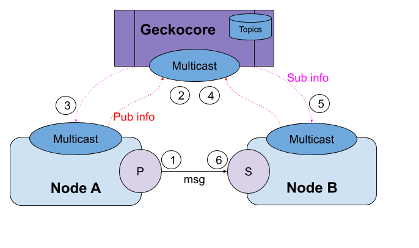

# :lizard:  pyGecko

[](https://pypi.python.org/pypi/pygecko/)
[](https://pypi.python.org/pypi/pygecko/)
[](https://pypi.python.org/pypi/pygecko)
[](https://pypi.python.org/pypi/pygecko)
[](https://travis-ci.org/gecko-robotics/pygecko)


## Install

- From pypi: `pip install pygecko`
- Local for development: `pip install -e .`

## `geckocore.py`



1. Binder opens a random port for data
    1. Note: either a publisher or a subscriber can bind to a port
1. Binder tells GeckoCore the topic and address/port
1. GeckoCore acknowledges the binder
1. A connector wants to connect to a topic and asks GeckoCore for the address/port
1. GeckoCore:
    1. If topic is found, return the address/port and an ok status
    1. If topic is *not* found, returns None
1. Connector connects to the binder with the given address/port
    1. *Binder:* only 1 per port, can be either pub or sub
    1. *Connecter:* can be many per port, can be pub or sub

This is the main message hub. GeckoCore also is passed the PIDs for processes on the
local machine and prints performance data on each process:

```bash
+========================================
| Processes Performance
| [24790] GeckoCore............. cpu:  0.3%  mem:  0.0%
| [24793] pub_ryan.............. cpu:  0.1%  mem:  0.0%
| [24795] pub_mike.............. cpu:  0.1%  mem:  0.0%
| [24796] sub_mike.............. cpu: 20.5%  mem:  0.0%
| [24797] pub_sammie............ cpu:  0.1%  mem:  0.0%
| [24798] sub_sammie............ cpu: 20.5%  mem:  0.0%
+------------------------------
| ESTABLISHED Connections
| pub_mike............ 192.168.86.22:50551 --> 192.168.86.22:50557
| sub_mike............ 192.168.86.22:50557 --> 192.168.86.22:50551
| pub_sammie.......... 192.168.86.22:50554 --> 192.168.86.22:50558
| sub_sammie.......... 192.168.86.22:50558 --> 192.168.86.22:50554
+------------------------------
| LISTEN Connections
| GeckoCore........... 192.168.86.22:11311
| pub_ryan............ 192.168.86.22:50548
| pub_mike............ 192.168.86.22:50551
| pub_sammie.......... 192.168.86.22:50554
+========================================
| Published Topics <topic>@tcp://<ip>:<port>
|  1: ryan@tcp://192.168.86.22:50548
|  2: mike@tcp://192.168.86.22:50551
|  3: sammie@tcp://192.168.86.22:50554
+========================================
```

```bash
========================================
 Geckocore [65975]
-------------
 Key: local
 Host IP: 10.0.1.57
 Listening on: 224.3.29.110:11311
-------------
Known Services [6]
 * hello:........................ tcp://10.0.1.57:65303
 * hey there:.................... tcp://10.0.1.57:65304
 * ryan:......................... tcp://10.0.1.57:65310
 * mike:......................... tcp://10.0.1.57:65311
 * sammie:....................... tcp://10.0.1.57:65312
 * scott:........................ tcp://10.0.1.57:65313

Binders [6]
 [65993] hello................. cpu:  0.0%  mem:  0.0%
 [65994] hey there............. cpu:  0.0%  mem:  0.0%
 [66008] ryan.................. cpu:  0.1%  mem:  0.0%
 [66010] mike.................. cpu:  0.1%  mem:  0.0%
 [66012] sammie................ cpu:  0.1%  mem:  0.0%
 [66014] scott................. cpu:  0.1%  mem:  0.0%

Connections [8]
 [65995] hello................. cpu: 20.7%  mem:  0.0%
 [65996] hello................. cpu: 20.9%  mem:  0.0%
 [65997] hey there............. cpu: 21.0%  mem:  0.0%
 [65998] hey there............. cpu: 20.8%  mem:  0.0%
 [66011] mike.................. cpu: 19.0%  mem:  0.0%
 [66013] sammie................ cpu: 19.0%  mem:  0.0%
 [66015] scott................. cpu: 19.4%  mem:  0.0%
 [66009] ryan.................. cpu: 18.7%  mem:  0.0%
```

## `geckolaunch.py`

`geckolaunch.py` allows you to launch a bunch of processes quickly using a launch
file. A launch file is just a simple json file where each line takes the form:
`[file, function, kwargs]`. Here is an example:

```bash
{
  "processes":
  [
    ["process", "publish", {"topic": "hello"}],
    ["process", "publish", {"topic": "hey there"}],
    ["process", "subscribe2", {"topic": "hello"}],
    ["process", "subscribe2", {"topic": "hello"}],
    ["process", "subscribe2", {"topic": "hey there"}],
    ["process", "subscribe2", {"topic": "hey there"}],
    ["process", "subscribe2", {"topic": "cv"}],
    ["process", "subscribe2", {"topic": "cv"}],
    ["process", "pcv", {"topic": "cv"}]
  ],
  "geckocore": {
      "host": "localhost"  # or hostname.local
  }
}
```

## `geckopy`

See the examples, but this acts like a `rospy` and helps make writing
pub/sub processes easy. See the `/examples` folder to see it in action.

- **init_node:** this sets up the the process for communications with `geckocore`
- **logxxx:** prints log messages
    ```python
    from pygecko import geckopy
    geckopy.loginfo('this is a info message')  # just send a string
    geckopy.logwarn('this is a warning message')
    geckopy.logerror('this is a error message')
    geckopy.logdebug('this is a debug message')
    ```
- **Subscriber:** creates a subscriber and appends the callback function to an
array in geckopy
- **Publisher:** creates a publisher and returns it
- **Rate:** given a frequency of how often a loop should run (i.e., 10Hz), the
returned object will dynamically set the sleep interval to achieve the rate. Ex:
    ```python
    from pygecko import geckopy
    rate = geckopy.Rate(20)  # run loop at 20 Hz
    while True:
        rate.sleep()
    ```

# Basic User API

- geckopy.*
    - init_node(kwargs)
    - logX(test, topic='log')
        - X: Error, Debug, Info, Warning
    - is_shutdown()
    - Publisher(topics, addr=None, queue_size=10, bind=True)
    - Subscriber(topics, callback=None, addr=None, bind=False)

# Change Log

Date        |Version| Notes
------------|-------|---------------------------------
2019-May-18 | 1.3.0 | working with c++
2019-Mar-02 | 1.2.0 | set multicast as the default method to find nodes
2018-Oct-28 | 1.1.0 | simplified and removed geckocore as the main hub
2018-Sep-16 | 1.0.3 | implemented a multicast connection process
2018-Sep-16 | 1.0.2 | dropping python 2.7 support, only 3.7+
2018-Sep-11 | 1.0.1 | working, but still need to flush it out some more
2018-Jul-28 | 1.0.0 | totally nuked everything from orbit and started over
2017-May-14 | 0.8.3 | updates and refactor
2017-Apr-02 | 0.8.2 | fix pypi doc and refactor
2017-Mar-19 | 0.7.0 | refactored
2017-Mar-12 | 0.6.0 | changed messages from dict to classes
2016-Dec-26 | 0.5.0 | refactor
2016-Oct-09 | 0.4.1 | published to PyPi
2010-Mar-10 | 0.0.1 | init


# MIT License

**Copyright (c) 2010 Kevin J. Walchko**

Permission is hereby granted, free of charge, to any person obtaining a copy of
this software and associated documentation files (the "Software"), to deal in
the Software without restriction, including without limitation the rights to
use, copy, modify, merge, publish, distribute, sublicense, and/or sell copies
of the Software, and to permit persons to whom the Software is furnished to do
so, subject to the following conditions:

The above copyright notice and this permission notice shall be included in all
copies or substantial portions of the Software.

THE SOFTWARE IS PROVIDED "AS IS", WITHOUT WARRANTY OF ANY KIND, EXPRESS OR
IMPLIED, INCLUDING BUT NOT LIMITED TO THE WARRANTIES OF MERCHANTABILITY, FITNESS
FOR A PARTICULAR PURPOSE AND NONINFRINGEMENT. IN NO EVENT SHALL THE AUTHORS OR
COPYRIGHT HOLDERS BE LIABLE FOR ANY CLAIM, DAMAGES OR OTHER LIABILITY, WHETHER
IN AN ACTION OF CONTRACT, TORT OR OTHERWISE, ARISING FROM, OUT OF OR IN
    CONNECTION WITH THE SOFTWARE OR THE USE OR OTHER DEALINGS IN THE SOFTWARE.
